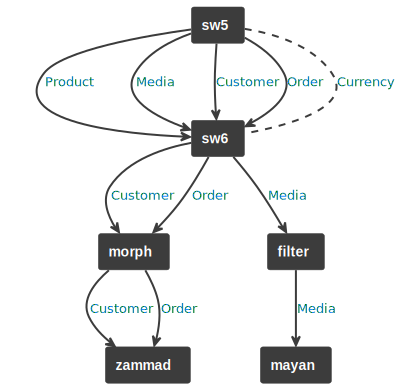

# Routing

Routing is a setup once configuration step right after you created and configured a [portal node](./portal-node.md).
Creating routes is a crucial step to control the data flow.
It defines which data is allowed to go in which direction.


## Structure of a route

A route is the combination of a starting portal node, a targeted portal node and a data type.
This is already an indicator that a data route is uni-directional.


## How to use

To create a route we want to know what data types we can connect between which portal nodes.
To get insights into the available portal nodes there is the command `heptaconnect:portal-node:list`.
The output can look similar to this:

```markdown
 ----------------- -------------------------------------------------------------------------
  portal-node-key   portal-class
 ----------------- -------------------------------------------------------------------------
  filter            Heptacom\HeptaConnect\Integration\Filter\Portal
  mayan             Heptacom\HeptaConnect\Portal\MayanEdms\Portal
  morph             Heptacom\HeptaConnect\Integration\Morph\Portal
  sw5               Heptacom\HeptaConnect\Portal\Shopware5\Portal
  sw6               Heptacom\HeptaConnect\Portal\LocalShopwarePlatform\Portal
  zammad            Heptacom\HeptaConnect\Portal\Zammad\Portal
 ----------------- -------------------------------------------------------------------------
```

There is a similar command for the available data types.
There is the command `heptaconnect:data-type:list` that lists all data types that are supported by the installed portals.
An output of the command can look like this:

```markdown
 -------------------------------------------------------------------------
  Heptacom\HeptaConnect\Dataset\Ecommerce\Product\Product
  Heptacom\HeptaConnect\Dataset\Ecommerce\Media\Media
  Heptacom\HeptaConnect\Dataset\Ecommerce\Product\Category
  Heptacom\HeptaConnect\Dataset\Ecommerce\Customer\Customer
  Heptacom\HeptaConnect\Dataset\Ecommerce\Order\Order
 -------------------------------------------------------------------------
```

With all the information above we can create routes that can resemble a scenario like the following:
* Send products, cms media, customers and orders from the old shop to the new shop 
* Send generated documents from the shop to the DMS
* Send customers and their orders to the help desk

To setup the described scenario we create routes with the command `heptaconnect:router:add-route`.
For the first mentioned instruction the command is used as the following:

```shell
bin/console heptaconnect:router:add-route sw5 sw6 'Heptacom\HeptaConnect\Dataset\Ecommerce\Product\Product'
```

The complete scenario can be setup with just the following few lines:

```shell
bin/console heptaconnect:router:add-route sw5 sw6 'Heptacom\HeptaConnect\Dataset\Ecommerce\Product\Product'
bin/console heptaconnect:router:add-route sw5 sw6 'Heptacom\HeptaConnect\Dataset\Ecommerce\Media\Media'
bin/console heptaconnect:router:add-route sw5 sw6 'Heptacom\HeptaConnect\Dataset\Ecommerce\Customer\Customer'
bin/console heptaconnect:router:add-route sw5 sw6 'Heptacom\HeptaConnect\Dataset\Ecommerce\Order\Order'
bin/console heptaconnect:router:add-route sw6 filter 'Heptacom\HeptaConnect\Dataset\Ecommerce\Media\Media'
bin/console heptaconnect:router:add-route filter mayan 'Heptacom\HeptaConnect\Dataset\Ecommerce\Media\Media'
bin/console heptaconnect:router:add-route sw6 morph 'Heptacom\HeptaConnect\Dataset\Ecommerce\Customer\Customer'
bin/console heptaconnect:router:add-route sw6 morph 'Heptacom\HeptaConnect\Dataset\Ecommerce\Order\Order'
bin/console heptaconnect:router:add-route morph zammad 'Heptacom\HeptaConnect\Dataset\Ecommerce\Customer\Customer'
bin/console heptaconnect:router:add-route morph zammad 'Heptacom\HeptaConnect\Dataset\Ecommerce\Order\Order'
```

The routes after this will look like this.


