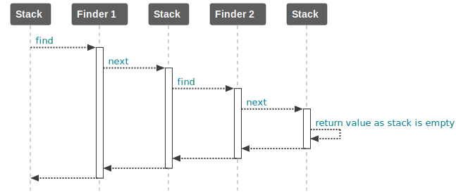

# Building flow components

## Preparation

This guide assumes you have been using HEPTAconnect as a [portal developer](../portal-developer/index.md) or [integrator](../integrator/index.md) before.
A possible reason you are reading this is, that you are in a similar situation like the following and think of solving the issue within the HEPTAconnect framework.


### Situation

An existing flow component like the [receiver](../portal-developer/receiver.md) gets multiple [receiver decorator implementations](../portal-developer/receiver-decoration.md) to stop following receivers on the stack to take action.
You see a pattern that all these changes in the reception stack are meant to prevent writing to an API and do a lookup instead.

The next steps are:

* to describe the pattern and locate it in its current situation
* to isolate its features
* to extract its exclusive features compared to existing flow components
* to question its introduction into the next version


### Pattern detection

The above detectable pattern is a reception decoration to lookup existing entries in a reception targeted portal node.
It takes place within a [data flow](../../reference/general-resources/data-flow.md) and introduces new behaviour that is not communicated by the receiver service contract.
The new behaviour prevents writing and makes a data lookup instead.
It can replace a reception and therefore be a new flow component.


### Feature isolation and exclusiveness

The potential new flow component can only replace a receiver.
This can also be turned into supporting readonly APIs without using a flow component that communicates writing in its description.
A portal developer can use code separation to separate features and different usage.
An administrator has a more flexible usage of the portal without additional configuration provided by the portal developer.


### Introducing the new flow component

Any existing setup should not behave differently, therefore using the new flow component needs to be optional.
A name has to be chosen carefully to match its features and usage.
In this case the name `Finder` has been chosen as flows are entity focused, and we try to find an entity in the targeted portal node.
In addition to the component name we will name the namespace `Find` and the methods will use the verb `find` as well.
As this flow component is intended to take part in a data flow we can use [route capabilities](../../reference/adr/2021-10-30-route-capabilities.md) to configure its behaviour.
New documentation on its usage for portal developer and administrator needs to be written.
The new flow component should follow patterns in implementation that other flow components have in common.


## Common implementation


### Stack

Flow component have certain properties, that allow to group them by.
For example, receivers are grouped by their supported dataset entity and their portals and supporting portal extensions they are provided with.
Based upon that, a portal and a portal extension can provide an implementation for a flow component that belong together and can influence each other.
Their code origin influences their order in the stack.
The order can be used to build an ordered stack out of it.
This stack is used to pass a certain payload into it, pass through every layer in their respective order and allow each layer to modify a possible result that is returned at the end of the stack iteration.
In the case of an [emitter](../portal-developer/emitter.md) stack the payload is a set of identities and its return value are resolved entities.
The flow components in a stack can halt stack iteration to allow full influence of behaviour.
The `next` method of the stack is the first entrypoint of a stack to start the layer iteration.



### Stack building

The stack order and its overall contents can differ in each usage situation.
To ensure reproducible order the building process is abstracted into its own service.
The stack builder is aware of a source instance, that can be provided from a portal or a portal extension.
This instance is the first in the order and is used in general as last entry in the stack.
Every other instance on the stack is called a decorator and provided by portal extensions.


### Call decoration

When the `next` method on the stack is called it has to call the `find` method of the first instance on the stack.
The `find` method of the finder instance itself gets the current stack as argument and can now take over the control of the following `$stack->next()` call.
This way a flow component can change the ingoing payload, the outgoing result and break the execution.


### Context

In addition to the omnipresent stack there is also the context.
Each flow component type has its own context.
The different contexts barely have anything in common and are specialized to provide functionality that only makes sense in usage of this specific flow component and cannot be provided by a service in the portal node container.
For example, the context in an emission has the method `isDirectEmission` to allow knowledge about its usage like a [direct emission](../portal-developer/direct-emission-explorer.md).
The `FindContext` could probably get information whether it is preceding a reception.


### Flow component contract class

A contract class for a flow component always has at least three methods:

* supports
* next
* run

The `supports` method represents every getter method that returns data to group a flow component instance by.
It is neither aware of the context nor the stack as it will be used to prepare both of these.
Every implementation of a flow component needs to provide the information about its supported topic or dataset entity.

The `find` method has already been introduced in the [stack explanation](#stack).
It needs to be pre-implemented to chain as described so a portal developer does not need to implement it.
The portal developer still needs to be able to override its implementation as this method is controlling the processing flow through the stack.

The `run` method has to have a signature that allows for a possible implementation with the least needed instructions to take effect.
This is the first entrypoint a portal developer will look for and has to enable the developer to see effects quickly.
The first entrypoint does not need to be the most efficient way but the most efficient way needs to possible and should be less complex than implementing `next` yourself.
A suitable example is the `\Heptacom\HeptaConnect\Portal\Base\Reception\Contract\ReceiverContract` it has a `run` and `batch` method, that allows to implement both scenarios but works out of the box independently whether `run` or `batch` is implemented.


### Short notation

The [short notation](../../reference/adr/2021-06-17-flow-component-short-notation.md) provides a different way to implement the flow component contract class.
For every overridable method of the `FinderContract` except `find` the portal developer shall be able to provide a closure as implementation.
The signature of these closures can have a custom rule set and must not be limited to the respective signature of the method in the contract to allow [dependency injection](../portal-developer/dependency-injection.md) by the portal node container.

All closures are collected in a token.
The token class `FinderToken` has no features beside storing closures.

To provide a fluent interface for portal developers to configure the token a builder class is needed.
All methods of the flow component specific builder need to be named the same as in the flow component contract class so its usage is the very similar to implementing the contract class.
Each method will store the parameters in the wrapped token instance and return itself to ensure a fluent usage.

To execute the closures in the token we need a generic implementation of the contract.
It will take the token in the constructor and execute each callback in the respective duplicated methods.
At this place you have to analyze the parameters of the token's closure and lookup any services from the service container.
This also allows custom rules to take effect.
For example, when you forward the `run` method to the closure you can also resolve a string parameter called `externalId` to be the previous parameter `$externalId` from the `run` method.

To access the new builder component the `\Heptacom\HeptaConnect\Portal\Base\Builder\FlowComponent` facade needs to provide a factory method named like the new flow component, so it can be used in short notation files.
It will also need to factorize the flow components.


### Code origin finder

Reasonable log messages are crucial.
Therefore, whenever HEPTAconnect is aware of a flow component being part of the log message's context, the file the flow component is written in is logged as well.
This feature is not possible without a `FinderCodeOriginFinder`.
It can differentiate between a token based implementation of the `FinderContract` and a classical implementation.
The token based implementation needs to evaluate the source of the closures in the token instead of the class implementations' source file.
The new code origin finder class can now be used along with the others in the `\Heptacom\HeptaConnect\Core\Component\Logger\FlowComponentCodeOriginFinderLogger` to improve log messages.


### Portal node container

Building the portal node container has a big impact on the usage of the newly created flow component.
It loads the short notation files and detects all implementations of the new contract class to propagate their existences.
This has to be implemented by scanning all implementations and pass the service references to the `\Heptacom\HeptaConnect\Core\Portal\FlowComponentRegistry`.


### Flow component registry

The flow component registry is the central place of a portal node container to supply all flow components for a portal node.
With the new parameter in the constructor and the newly found services in the portal node container, only a getter for the instances is missing.


### Factory

As the context and the stack building are specialized for situations, factories are essential tooling.
These factories are not accessible by portals.
The `FinderStackBuilderFactory` will load a portal node container and request the finder flow component instances from the flow component registry.
Now the stack builder has everything to work with later on.


### Actor

Most of the previous parts are taking place in the portal base package.
Everything is ready for portals and extensions to use the new flow component.
The next big step is to teach the core package what to do with the new flow component.
The service that will actually work with the new flow components is an actor, the `FindActor`.
Its implementation precisely knows how to process a stack properly.
The `performFind` method of this service looks similar to a contract class `find` as it does not create the stack and context it will work with later.
An actor often validates incoming data (e.g. does not forward to the stack at all when empty), triggers different actions like follow-up flows and checks for race-conditions.


### Service

The main entrypoint for every execution of the new flow component is its own service.
`FindService` will take as few arguments as needed to build a stack, create a context and execute the `FindActor`.


### Jobs

HEPTAconnect can outsource flow component processing as jobs in different processes (commonly on different machines).
To support this we need to introduce a job for the new flow component.
Job classes need to be based upon `\Heptacom\HeptaConnect\Core\Job\Contract\JobContract`.
Instances of a job class contain all infos that is needed to process a job.
In the best scenarios a job is only aware of an identity.
In our scenario we want to behave similar to the reception and therefore also need the entity to lookup later.
The entity will be part of the payload of the `Find` job.
Instances of these job type instances can now be dispatched using the `\Heptacom\HeptaConnect\Core\Job\Contract\JobDispatcherContract`.
Its implementation ensures forwarding the job and its payload to be used in other process like a message queue or a child PHP process.


### Job handling

The job has been dispatched to be handled separately from the current PHP process.
When the job is ready to execute it needs to be handled again.
The `FindJobHandler` will track the job processing state, read the jobs' payload and pass the job payload to the `FindService`.


### Route capability usage

Now we are about to finish the initial task.
The storages need to know about the new route capability.
We designed it to be optional and name it `find`.
Right before reception jobs will be dispatched we decide to ask the storage for the route capability and dispatch a `Finder` job instead.


### Admin UI

Often it is useful to have certain utilities for the administrator.
In this scenario you only have to make sure the new route capability is available in the storage implementations, but the admin UI is already able to display the route capability.
It is probably that your new flow component will be part of the admin UI.


## Summary

### Portal base

We need to provide contracts for the portal developer to use.
You are most likely having a file structure of new files like this:

```
<portal-base-source>
├── Builder
│   ├── Builder
│   │   └── FinderBuilder.php
│   ├── Component
│   │   └── Finder.php
│   └── Token
│       └── FinderToken.php
└── Find
    ├── Contract
    │   ├── FindContextInterface.php
    │   ├── FinderCodeOriginFinderInterface.php
    │   ├── FinderContract.php
    │   └── FinderStackInterface.php
    ├── FinderCollection.php
    └── FinderStack.php
```

so könnte es sein

```
<portal-base-source>
└── Find
    ├── Contract
    │   ├── FindContextInterface.php
    │   ├── FinderBuilderInterface.php
    │   ├── FinderCodeOriginFinderInterface.php
    │   ├── FinderContract.php
    │   └── FinderStackInterface.php
    └── FinderCollection.php
```

### Core

The actual usage of the new flow component needs to be handled within the core.
You are most likely having a file structure of new files like this:

```
<core-source>
├── Find
│   ├── Contract
│   │   ├── FindActorInterface.php
│   │   ├── FindContextFactoryInterface.php
│   │   ├── FindServiceInterface.php
│   │   ├── FinderStackBuilderFactoryInterface.php
│   │   └── FinderStackBuilderInterface.php
│   ├── FindActor.php
│   ├── FindContext.php
│   ├── FindContextFactory.php
│   ├── FindService.php
│   ├── FinderCodeOriginFinder.php
│   ├── FinderStackBuilder.php
│   └── FinderStackBuilderFactory.php    
└── Job
    ├── Contract
    │   └── FindHandlerInterface.php
    ├── Handler
    │   └── FindHandler.php
    └── Type
        └── Find.php    
```

so könnte es sein

```
<core-source>
└── FlowComponent
    └── Find
        ├── Contract
        │   ├── FindActorInterface.php
        │   ├── FindContextFactoryInterface.php
        │   ├── FindJobHandlerInterface.php
        │   ├── FindServiceInterface.php
        │   ├── FinderStackBuilderFactoryInterface.php
        │   └── FinderStackBuilderInterface.php
        ├── FindActor.php
        ├── FindContext.php
        ├── FindContextFactory.php
        ├── FindJob.php
        ├── FindJobHandler.php
        ├── FinderToken.php
        ├── FinderBuilder.php
        ├── FindService.php
        ├── FinderCodeOriginFinder.php
        ├── FinderStackBuilder.php
        ├── FinderStackBuilderFactory.php
        └── TokenFinder.php
```
