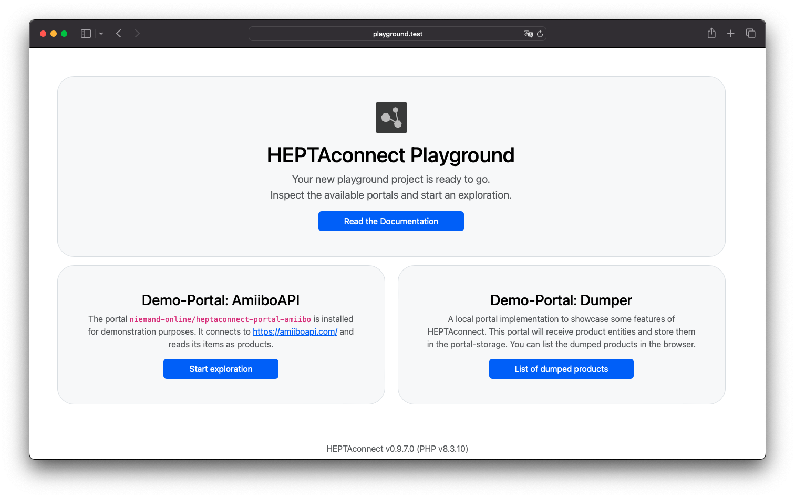

# Playground

You can take your first steps with HEPTAconnect by installing the Playground and inspecting its code.
The Playground is our demo-project to showcase various features of HEPTAconnect and explain our approach to customization.

## Requirements

- [PHP](https://www.php.net/): 8.2 or higher
- [MySQL](https://www.mysql.com/): 5.7 or 8.x
    - [MariaDB](https://mariadb.org/) is known to have issues
- [Composer](https://getcomposer.org/): 2.0 or higher
- Any web server that is able to serve [Symfony](https://symfony.com/) applications
    - Learn more about [Configuring a Web Server](https://symfony.com/doc/5.x/setup/web_server_configuration.html) from the official Symfony documentation.
    - For local environments, we recommend [Laravel Herd](https://herd.laravel.com/) (which is based on PHP-FPM and Nginx).

## Installation

```sh
composer create-project heptaconnect/playground
```

This command will execute these steps:

1. Download the Playground project
2. Download the project's dependencies
3. Ask you some questions during the setup process
    - Environment (dev / prod)
    - URL (for user interface)
    - Database information
4. Create the database and run all migrations

Alternatively, you can do it manually using these steps.
This way, you have more control over the installation process.

```sh
# Download the Playground project
composer create-project heptaconnect/playground --no-install --no-scripts

# Move into Playground directory
cd playground

# Download the project's dependencies
composer install

# Ask you some questions during the setup process
bin/console system:setup

# Create the database and run all migrations
bin/console system:install
```

Now the last step is to configure your web server to serve the Playground project.
Set `<project-dir>/public` as the document root directory.

!!! success
    That's it. The system installation is complete.

## User Interface

By default, HEPTAconnect does not come with a user interface.
However, we did create a minimalistic interface to demonstrate, how you could build such interfaces in your own project.

Open the URL that you provided during the setup process. You should be greeted by this page.



## Pre-Installed Portals

The Playground showcases a basic transfer of product data without an actual real-life data source for products.
Instead, we use the portal `niemand-online/heptaconnect-portal-amiibo` which uses [amiiboapi.com](https://amiiboapi.com/docs/) to fetch structured data about Amiibo toys.
This data is then transformed into product entities and emitted into HEPTAconnect.

The target portal for this transfer is a generic dumper implementation.
This portal receives any data entities you throw at it and stores it in the HEPTAconnect database.
It also provides a page for the user interface to display the products in its storage.

## Transfer Data

HEPTAconnect uses [Symfony Messenger](https://symfony.com/doc/5.x/messenger.html) to process data transfers asynchronously.
To start a worker process, you can run this command.

```sh
bin/console messenger:consume
```

This is a long-running process.
The command will not exit, unless it receives a stop-signal (e.g. `SIGINT` or `SIGTERM`).

To initiate the transfer, you have to trigger an exploration.
The easiest way to do that is by clicking the button `Start exploration` in the user interface.
Alternatively, you could also run this command.

```sh
bin/console heptaconnect:explore amiibo 'Heptacom\HeptaConnect\Dataset\Ecommerce\Product\Product'
```

The exploration will fetch data from the data source and transform it into entity objects.
These entities are then emitted to HEPTAconnect.
That means, jobs for data receptions are dispatched to the message queue.
These jobs are then picked up by the worker process and executed.
This sends the entities to the receiver of the target portal.

Once you have started an exploration and the worker has processed all subsequent jobs, you can view the received products in the user interface by clicking the button `List of dumped products`.

!!! success
    Well done! You just transferred your first entities via HEPTAconnect.

Now you can work your way through the source code and learn how we build this demo.
Most of the interesting files are located in the `<project-dir>/src` directory.
