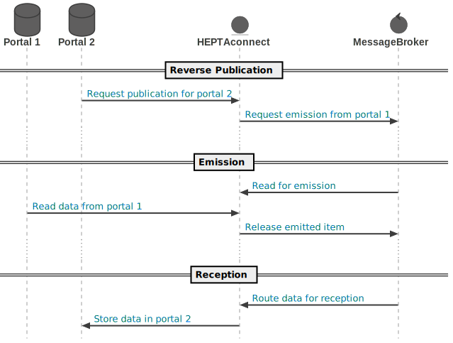

# Data flow

In HEPTAconnect we separate different steps where data processing is happening to have different entry points for developers and enable horizontal scaling for each step.
The main steps are exploration, emission and reception.
The exploration can be triggered from different places and will follow in emissions and receptions when the data routes exists.
In the following paragraphs you will see what kind of data flows can occur:

## Basic flow

The basic flow of the previous mentioned steps exploration, emission and reception in their most common form.
For this you need to implement a handler for each step: An [explorer](../../guides/portal-developer/explorer.md), an [emitter](../../guides/portal-developer/emitter.md) and a [receiver](../../guides/portal-developer/receiver.md).

## Direct emission flow

This is a condensed form of the basic flow as the first two steps are merged into one.
A very useful pattern for sources that do not differ between gathering selecting primary keys and their corresponding data on it.
For this flow you only need to implement [explorers](../../guides/portal-developer/explorer.md) as [direct emission explorers](../../guides/portal-developer/direct-emission-explorer.md) and [receivers](../../guides/portal-developer/receiver.md).
To ensure other flows like the next one you still have to provide an [emitter](../../guides/portal-developer/emitter.md) which can be omitted otherwise.

## Reverse publication flow

The reverse publication is requesting data from a previously running transfer a second time to keep data up-to-date.
This is useful for any event driven data transfer that has to happen on demand.

