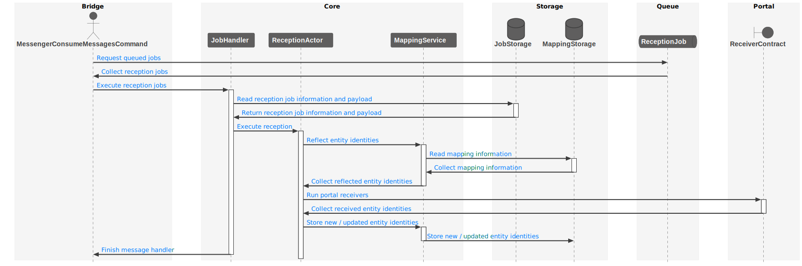

# Basic flow in detail

In the following we get more into the details from the basic flow from two perspectives.
First perspective is seen from the portal and the second perspective is based upon the HEPTAconnect Core.

## Portal's point of view

## Core's point of view

### Exploration

### Emission

### Reception

