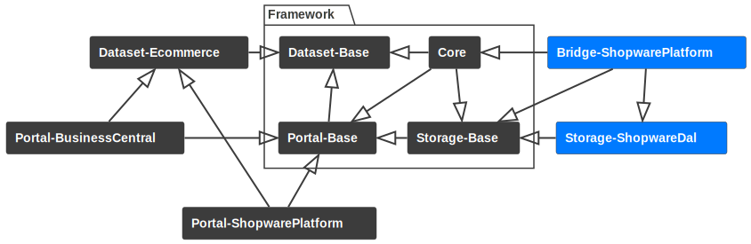
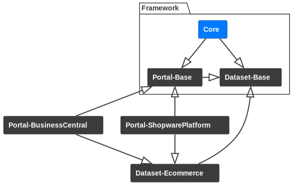
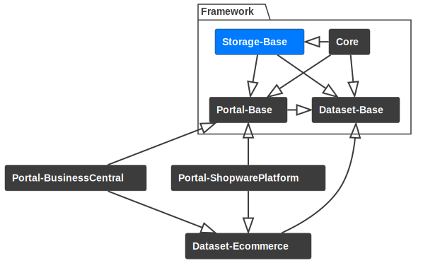
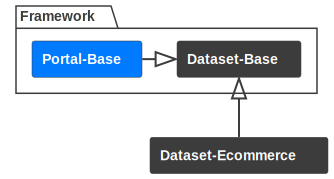
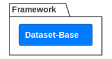
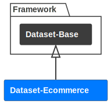
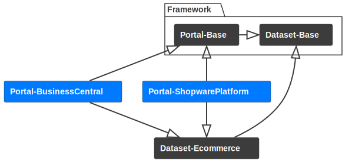
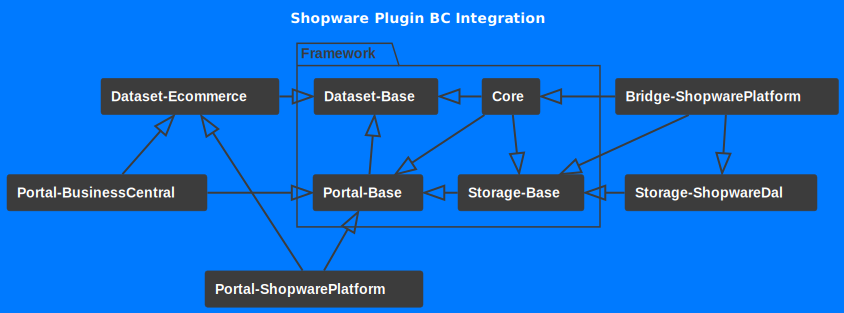

# Package structure

This software is divided into several repositories that have composer dependecies on each other.
Some of the packages are always required for a functional HEPTAconnect ecosystem while others are more or less optional or specific to the use case.
This article attempts to clarify the structure of the different packages and outline their role in the ecosystem.

### Bridge

HEPTAconnect is designed to be able to adopt to its surrounding software.
Therefore the core itself will not run without a surrounding runtime.
To make this work, there are bridges to connect the core with a runtime.
The runtime will then (through the bridge) provide a storage, a messenger and several other components that the core will then make use of.
Because of this approach, the core is very portable and can run in a number of runtimes (if they can provide all requirements).

### Core

At its core HEPTAconnect manages data streams between different endpoints via asynchronously handled messages.
One side goes through its entities for a dataset and emits whatever it can find.
The other side receives these entities and saves them to an other endpoint.
It is the core's job to coordinate this traffic and keep things organized.
So the core provides a router, a mapping service, an emit service, a receive service, a webhook service and other tooling.

### Storage-Base

Certain components of HEPTAconnect require a form of persistent storage.
An example is the mapping of entities.
To remember which records of different portal nodes are actually the same entity, a mapping is created and stored in a storage.
The storage base will only provide interfaces for the storage, so the core can interact with the storage but does not need to know the actual implementation.

### Portal-Base

Since HEPTAconnect itself is not much more than a framework, it does not come with any external connectivity.
To connect an external API, you will need to provide a portal for this API.
A portal has to require the portal base and whatever datasets it may support.
The portal base comes with structs and interfaces that a portal will need in order to work.

### Dataset-Base

HEPTAconnect is all about data.
Reading data, moving it from one point to an other and writing it again.
To make different portals understand each other, they use common datasets.
A dataset is a group of class definitions for a type of data.
Usually these data types are grouped into sets by their topic.
The dataset base consists of interfaces and helper classes to make up a base for the individual datasets.

### Dataset

A single dataset can hold a number of classes for different data types.
Datasets can also require other datasets to make up larger sets.
The dataset for physical locations has no requirements as it is very much limited to its own case that cannot be further broken apart.
The dataset for ecommerce is rather complex and has requirements for many other datasets to cover parts of its needs.

### Portal

Because HEPTAconnect should bring data of different systems together, it has to be someone's responsibility to actually connect to different systems.
This is where portals come into play.
A portal is a package with emitters and receivers that can read data from and write data to an endpoint.
In most cases this endpoint is an API of some sort, but it does not have to be one.
In theory this can also be an access to a static local file or a local database.
The important part is that a portal connects an external system with the HEPTAconnect ecosystem.
The portal has to require all its supported datasets.
Portals with shared supported datasets are natively compatible with each other, as their data can be easily transferred from one portal to the other.

### Integration

The integration is the one package that holds it all together.
It is a composition of all required packages necessary for the use case at hand.
So this package really changes from project to project and is the most individual part of the software.
Typically an integration is composed by specifying all portals that should be connected with each other and a runtime for the software to run.
In this example we choose the Shopware bridge as the runtime and the portals for Shopware and Business Central as our portals.
Because our runtime is Shopware, the integration has to be a Shopware plugin with the bridge and the portals registered as additional bundles.

